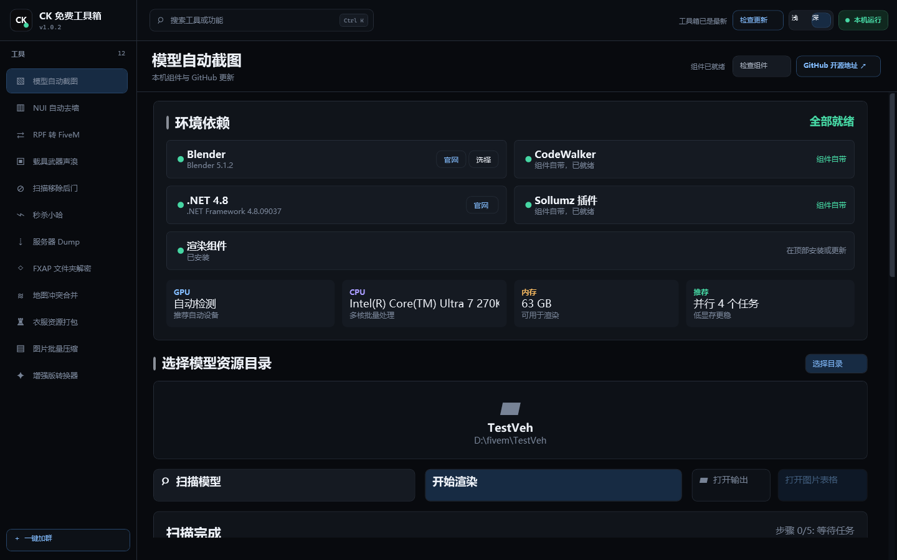
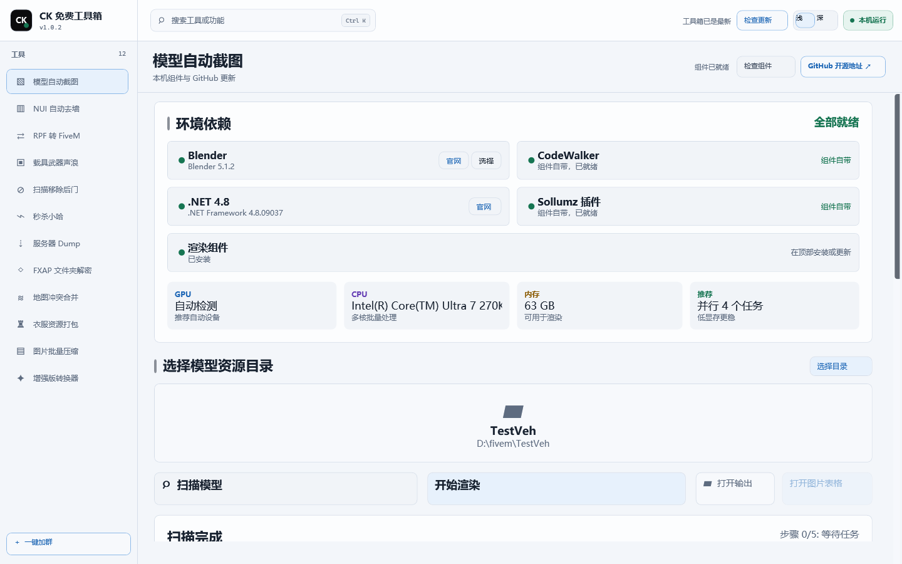
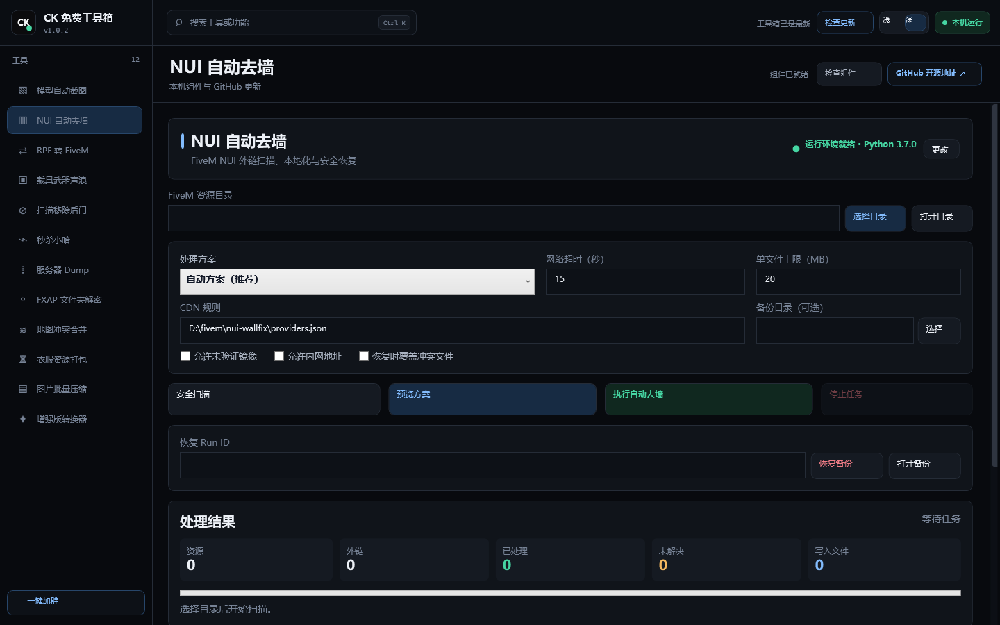
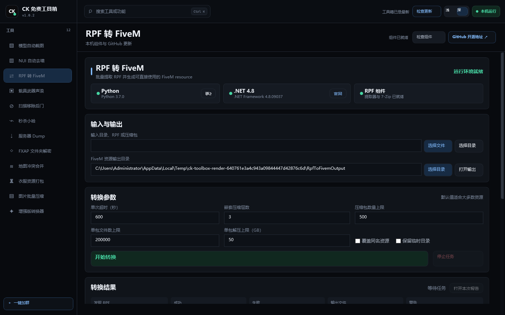

# CK免费工具箱

CK免费工具箱 v1.0.2 是纯本机客户端工具，不需要服务端文件、HTTP API 或后台服务。推荐通过 CK免费工具箱.exe 启动，窗口和任务栏使用 static/cklogo.ico。

本仓库不是空外壳。`CKFreeToolbox.ps1` 和 `app/` 包含窗口、环境检测、任务进程、日志、组件安装更新及模块化功能页的客户端实现。模型渲染、NUI 重写、RPF 转 FiveM、服务器 Dump、FXAP 解密、扫描移除后门和秒杀小哈引擎分别由对应 GitHub 仓库维护；其中 FXAP 组件来自 [ch-jack/fxap_only](https://github.com/ch-jack/fxap_only)，工具箱运行后按需下载。
地图冲突合并页面接入 [ch-jack/SnowyMerger](https://github.com/ch-jack/SnowyMerger)，同样通过稳定 Release 按需安装，不在工具箱仓库内复制其引擎源码。
衣服资源打包页面接入 [ch-jack/red40_clothing_packer](https://github.com/ch-jack/red40_clothing_packer) 的 Windows x64 CLI；组件仍由稳定 Release 按需安装，不打包上游 GUI 或引擎源码。
图片批量压缩页面接入 [ch-jack/fivem_compression_img](https://github.com/ch-jack/fivem_compression_img)，通过 FFmpeg 处理 JPG、PNG、GIF 和 WebP；CLI 按需安装，FFmpeg/ffprobe 由用户单独配置。
FiveM NUI 调试页面接入 [ch-jack/vjmidevtools](https://github.com/ch-jack/vjmidevtools) 的 Arya Windows x64 程序；组件按需安装，不依赖系统 Python，也不会预装进工具箱发布包。

主界面支持深色与浅色主题。首次启动跟随 Windows 应用主题，用户手动切换后会把选择保存到根目录 `config.json`；顶部搜索框可按工具名称筛选，`Ctrl+K` 可快速聚焦。

## 界面预览

### 模型自动截图（深色）

### 模型自动截图（浅色）

### NUI 自动去墙

### RPF 转 FiveM

## 启动

双击：

~~~text
D:\fivem\ck_free_toolbox\CK免费工具箱.exe
~~~

start_toolbox.cmd 仅用于开发排错。不要只复制 EXE；主脚本、app/ 和 static/ 必须与 EXE 保持原目录结构。

## 一键打包

开发者双击 `一键打包发布包.cmd`，脚本会自动：

- 重新构建 `CK免费工具箱.exe`。
- 不预先下载或打包 `vehicle_renderer`、`nui-wallfix`、`rpf_to_fivem`、`dump-tool`、`fxap-decryptor`、`ck_anti_john` 和 `xiaoha_cleaner`。
- SnowyMerger 的 snowy-merger 目录也不预装；页面缺少组件时通过统一组件管理器下载、校验、备份并切换。
- Red40 Clothing Repacker 的 red40-clothing-packer 目录也不预装，只保留中文 CLI 操作页面。
- 保留组件检测、GitHub 安装、校验、更新、备份和失败回滚代码。
- 不复制 Blender、Python、Node.js 或 Java；依赖由用户安装，工具箱只负责真实检测、官网跳转和路径选择。
- 生成可以直接发给用户的轻量客户端目录和 ZIP。
- 写入使用说明、版本、运行时组件策略和 SHA-256 清单。

默认产物位于 `dist/CK免费工具箱-v1.0.2/` 和同名 ZIP。用户解压后直接双击最外层 `CK免费工具箱.exe`。页面检测到组件缺失时，点击“安装组件”才会从对应 GitHub 仓库下载。Blender、Python、Node.js 和 Java 均需用户独立安装。

命令行用法：

~~~powershell
powershell.exe -NoProfile -ExecutionPolicy Bypass -File .\tools\Build-ReleasePackage.ps1
~~~

可用 `-SkipArchive` 只生成发布目录。

## GitHub 自动构建与发布

`.github/workflows/build-release.yml` 只检出并构建本仓库，不拉取任何已登记的外置功能组件：

- 推送到 `main` 时，自动生成 `v1.0.<run>` 版本，构建 EXE/ZIP、上传 Artifact 并创建正式 GitHub Release。
- Pull Request 只执行构建验证，不发布 Release。
- 手动推送 `v*` 标签时仍按指定标签发布；自动版本会同步写入 EXE、界面和包清单。
- 自动构建和发布都不会下载或打包 Blender、Python、Node.js、Java 或外置功能组件。

发布命令：

~~~powershell
git tag v1.0.2
git push origin v1.0.2
~~~

## 功能

### 模型自动截图

- 扫描目录中的 .yft、.ydr、.ydd 和 .ymap。
- 支持载具、武器、饰品、道具、普通 Drawable、Drawable Dictionary 和地图。
- 支持按载具、武器、饰品分类筛选，并保留实时搜索、全选、取消、打开输出目录和批量渲染。
- 载具目录会读取资源根目录或 `data/子包/` 中的 `vehicles.meta/carvariations.meta`，列表只显示基础车型；轮拱、离合器、保险杠等分离 `.yft` 改装件由组件组装到整车，不再作为独立截图任务。第三方 XML 含非法注释、重复声明或拼接文档时只在内存中修复；仍损坏则从 `modelName` 恢复基础车型，不修改源文件。
- 严格使用本次输入目录内 `vehicles.meta/modelName` 与 `handling.meta/handlingName` 的全局交集确认基车；只有交集中的同名 `.yft` 会显示和渲染，`carvariations.meta` 组件及其他未确认 YFT 全部忽略，避免 `grill`、`roof`、`skirts`、`tips`、`livery` 单独出现。
- 组件不会单独占用列表和任务，但渲染确认基车时仍由模型组件读取 `carvariations.meta + carcols.meta`，自动拼装组件后输出整车截图。
- 一万文件级目录会持续显示扫描数量、候选数量、任务准备进度及当前开始渲染的模型；渲染队列按并发数有界调度，日志和列表状态逐车更新。
- 分类筛选会传给 `--asset-types`；角度预设提供当前左侧、标准正面和反向正面，兼容本地前向轴相反的模型。
- 使用已安装 Blender 自带 Python；玩家只需选择安装目录中的 `blender.exe`，最低支持 Blender 4.2（推荐 5.1），CodeWalker 转换工具与 Sollumz 使用模型组件内置路径。
- RPF 解包和 YTD 纹理中间文件统一写入本次输出目录的 `_temp`，不占用系统临时目录，任务结束自动清理。
- 每次渲染都会生成带模型名和对应图片的 HTML 表格，以及独立 Markdown/JSON 执行报告；页面确认报告属于本轮任务后启用“打开图片表格”。

### NUI 自动去墙

- 支持选择单个 FiveM resource 或整个 `resources` 目录，扫描 HTML、CSS、JavaScript 和资源清单中的外链。
- “安全扫描”只读且不访问网络；“预览方案”会解析替换结果，但不修改目标文件。
- 必须选择具体 resource 或 resources 目录；工具箱会阻止扫描磁盘根目录和自身工作区，长任务可随时停止。
- 正式写入支持自动、完全本地化和国内 CDN 三种方案，并可限制超时与单文件大小。
- 每次正式写入都在目标目录外创建备份，结果提供 Run ID，可从工具箱直接恢复。
- 支持自定义 `providers.json`、未验证镜像、内网地址和冲突时强制恢复等高级选项。
- 直接调用随包发布的 `nui-wallfix.py`，不需要后端服务；Python 必须实际运行并满足 3.7+，不会把 WindowsApps 商店占位程序误判为已安装。
- Python 缺失时显示官网下载按钮，安装后可选择安装目录中的 `python.exe`。
- 扫描、预览、正式写入、恢复及可捕获失败分别生成专属执行报告；页面可打开本次报告或报告历史。

### RPF 转 FiveM

- 支持输入目录、单个 `.rpf`，以及 ZIP、RAR、7Z、TAR 和嵌套压缩包。
- 每个 RPF 自动生成一个独立 FiveM resource，并写入 `fxmanifest.lua` 和可识别的 `data_file`。
- 支持载具、武器、饰品、地图、碰撞、导航、动画、粒子、声音及其他 GTA V/FiveM stream 文件。
- 提供覆盖、保留临时目录、超时、嵌套深度、压缩包数量、文件数和解压大小限制。
- 长任务可停止；完成后显示成功、失败、输出文件、警告和逐资源明细，并只允许打开本轮转换生成的 JSON 报告。
- 直接调用 Release 内的 `rpf_to_fivem.py`、`CkRpfExtractor.exe` 和 `7z.exe`，不需要后端或源码仓库。
- Python 缺失时提供官网和选择按钮，选择结果与 Blender 路径共用根目录 `config.json`。
### 地图冲突合并

- 选择 GTA V 本体、包含多个 FiveM 地图 resources 的 Mods 目录和输出父目录。
- 以 GTA V 原版 RPF 为基线合并重复 YMAP，并同步处理对应 YBN/YDR、scenario YMT、META、water.xml 和 heightmap.dat。
- 页面实时显示冲突数量、已处理文件组、进度与原始日志，长任务可以停止。
- 输出固定写入 <输出目录>/snowy_merger/，任务日志归档到 %LOCALAPPDATA%/CKFreeToolbox/snowy-merger-reports/。
- 组件从 [ch-jack/SnowyMerger](https://github.com/ch-jack/SnowyMerger) 的稳定 Release 安装，并校验独立 SHA-256 附件。
- 运行依赖系统 .NET 8 Runtime 和本机 GTA V；不需要 Python、Node.js、Java 或后台服务。

### 衣服资源打包

- 中文页面只调用 `ClothingRepacker.Cli.exe`，覆盖 CLI 提供的分析、生成、应用、恢复、三种校验、报告和 YMT XML 导出；不启动 GUI。
- 分析支持扫描一个资源父目录，或逐个添加跨目录 resource；可设置目标 resource、集合前缀、组件/prop drawable 上限和 YMT 使用优化。
- 生成与报告用于先审查结果；apply 默认启用 `--copy-resources-to-output`，关闭后会直接修改源 resource，并在执行前再次警告。
- build/apply 的 YMT XML 与客户端校验脚本开关、export-xml 的覆盖开关、以及 CLI 版本检查开关均可在页面配置。
- restore、原地 apply 和覆盖 XML 都有中文风险提示；每次执行保留原始 CLI 输出，并归档到 `%LOCALAPPDATA%/CKFreeToolbox/clothing-repacker-reports/`。
- 本页面 analyze 会给 `plan.json` 写入 `.ck-plan.json`，锁定方案 SHA-256、路径范围及规划所依赖的 YMT/XML/meta/manifest 哈希；stream 改名源会复核存在性和目标冲突，但不会在界面线程重复哈希大型 YTD/YDD。build 和 apply 拒绝外部、被改动或规划输入已经变化的方案，避免绝对路径越界和陈旧映射。
- apply 每次都会在所选备份目录下创建唯一运行子目录，并给新 `backup-manifest.json` 写入 `.ck-restore.json`；复制模式若发现同名输出目录会拒绝执行，避免上游递归替换无法恢复的旧内容。恢复旁车独立采集实际备份文件哈希，不依赖上游清单的哈希字段；restore 在执行前复核清单、备份文件、生成目录和 resource 范围，并显示将删除/覆盖/移动的数量。
- 组件从 [ch-jack/red40_clothing_packer](https://github.com/ch-jack/red40_clothing_packer) 的稳定 Release 安装，校验独立 SHA-256；发布包只含自包含 Windows x64 CLI、README、GPL-3.0 许可证和 CodeWalker 第三方声明。

### 图片批量压缩

- 支持单文件和目录递归压缩 JPG/JPEG、PNG、GIF、WebP，参数包括画质、最大尺寸、并行数、PNG 压缩/调色板、GIF 颜色数、WebP 压缩/无损模式和动画最高帧率；只有源帧率超过上限时才降帧，不会补帧。
- 默认写入独立输出目录且只采用体积更小的结果；原地压缩需要明确勾选、再次确认，并在输入路径外建立备份。
- 动态 GIF/WebP 压缩后会再次解码并检查动画没有变成单帧；长任务可停止 Python 与 FFmpeg 整个进程树。
- 每次运行生成 UTF-8 CSV 和 JSON，逐文件记录文件名、格式、原大小、新大小、节省空间、压缩率、耗时和错误。
- 组件从 [ch-jack/fivem_compression_img](https://github.com/ch-jack/fivem_compression_img) 的稳定 Release 按需安装并校验 SHA-256；FFmpeg 与 ffprobe 不打包进组件或工具箱。

### FiveM NUI 调试

- 通过 FiveM 本机 `localhost:13172` Chrome DevTools Protocol 端口监控 NUI 流量、检查目标、导出 HTML/JavaScript，并对明确选择的 NUI 上下文执行调试脚本。
- Arya 以自包含 Windows x64 组件运行；优先打开 WebView2 窗口，失败时回退到本机浏览器，不要求用户安装 Python。
- 本地控制 API 只监听 `127.0.0.1:5000`，使用每进程随机会话、Host/Origin 校验；端口被其他程序占用时只报错，不会结束对方进程。
- URL 屏蔽默认不启用任何隐藏规则；vRP 批量传送、封禁、监禁、消息和转账在执行前再次确认。
- 仅限自有或明确授权的服务器和资源；JavaScript、URL 屏蔽及批量管理动作可能影响实时玩家和服务器数据。

### FXAP 文件夹解密

- 选择直接包含 `.fxap` 的单个 resource，或包含多个 resource 的父目录；输出自动写到相邻的 `<目录名>_decrypted`。
- CFX server key 可留空；未提供 key 或当前 resource 密钥不完整时，由 `fxap_only` 按 resource ID 查询 Keymaster grants API，客户端派生再调用 Cloudflare。
- 工具箱不提供、保存或传递 Bearer Token；grants API 鉴权和 Cloudflare 派生配置都只由 `fxap_only` 负责。
- 页面实时显示资源、解密、复制、Lua 输出和失败数量，并支持停止任务与打开输出目录。
- 每次任务结束都会生成 Markdown 和 JSON 报告；页面可直接打开本次报告或报告历史，报告不会写入 CFX key 或 Bearer Token。
- Node.js 18+ 和 Java 都使用用户外部安装；Java 可选，缺失或反编译失败时保留 `.luac`。
- 可选顶点修复只复制本次完整解密成功的 FXAP 资源，在原输出目录旁生成完整副本，并仅处理副本内的 `.ydr`、`.yft`、`.ydd`；原解密结果不会被覆盖。
- “完成后自动打开文件夹”默认勾选；生成修复副本时打开副本，否则打开原解密目录。顶点修复需要系统 .NET 8 Runtime。
- 组件从 [ch-jack/fxap_only](https://github.com/ch-jack/fxap_only) 的稳定 Release 安装并校验 SHA-256，不包含 `decrypt-eup-stream.js` 功能。

### 服务器 Dump

- 支持输入 `https://cfx.re/join/xxxx` 或 `IP:端口`，默认自动扫描 FiveM 进程 token；需先进入目标服务器的加载界面，再获取资源清单并开始 Dump。
- 资源下载遇到可恢复的 403、404、429、5xx、连接中断或超时时会有限重试；任务日志显示重试与恢复情况，结果页和完整报告会列出最终未下载成功的资源、文件、状态码、尝试次数及原因。
- “补充失败下载”可选择上一次 JSON/Markdown 报告，只重新请求其中失败或等待解密前置的文件，并合并回报告记录的原输出目录；新报告仍有失败时可以继续下一轮。解密模式会额外下载必要的 RPF/`.fxap` 上下文，但不会重复下载其他已成功文件。
- 补充流程不会自动执行顶点修复，只更新原解密输出或原始保留输出，避免覆盖已有的顶点修复副本。
- 旧报告里的资源如果已从服务器移除或改名，会标记为不可用并保留到下一轮；其余仍存在的资源会继续补充，不会整体终止。
- “解密 FXAP”默认勾选；取消后不会执行 FXAP 解密或顶点修复，也不要求 Java，而是在逐资源临时目录清理前，将 `.fxap`、加密文件、脚本和所有子目录完整复制到输出目录。
- 包含服务器 Dump 和 FXAP 解密；可选的顶点修复只对本次成功解密的 FXAP 资源生效，会在原输出目录旁复制完整资源目录，仅处理副本中的 `.ydr`、`.yft`、`.ydd`，不覆盖原解密输出。
- “完成后自动打开输出文件夹”默认勾选；启用顶点修复时打开修复副本，否则打开原解密目录。
- 顶点修复依赖系统 .NET 8 Runtime，页面会检测并提供官网下载按钮。顶点修复不等于模型修复，不一定能 100% 修复模型，也不保证修复后的模型可以被 FiveM 加载。如需修复模型，可以进群找群主免费修复。

### 扫描移除后门

- 支持选择单个 FiveM resource、整个 `resources` 目录或 ZIP。
- “扫描后门”只读、不联网、不提取 ZIP，也不会执行目标中的 Lua、JavaScript 或 HTML。
- 大目录默认使用最多 8 个线程；页面实时显示统计文件、完成数/总数、百分比、当前文件和线程数，不再长时间无反馈。
- 覆盖 GP212887 精确链、Lua 远程执行、XOR/Base64/LZString/Node VM JavaScript 投递器、manifest 注入、Blum/Warden/Cipher IOC 和 txAdmin 篡改。
- “移除预览”只生成动作；“确认移除”会先备份目录目标并在写入后自动复检。
- ZIP 默认保留原包并生成 `*.cleaned.zip`；目录修复返回 Run ID，可在页面直接恢复。
- 组件从 [ch-jack/ck_anti_john](https://github.com/ch-jack/ck_anti_john) 的稳定 Release 安装并校验 SHA-256。
- 页面提供“打开本次报告”：优先打开组件原生清理报告；扫描、预览和恢复则保存并打开本次原生 JSON 结果。

### 秒杀小哈

- 支持选择 FiveM `server-data`、`resources` 或单个资源目录，先执行只读扫描并列出小哈资源、代码注入和关联 SQL。
- 自动读取 `server.cfg` 以及 `exec` 配置链中的 MySQL 连接信息；密码不会显示在界面、日志或报告中。
- 资源和代码清理会把文件移动到目标目录外的隔离区，并生成 `run-report.json`，可在工具箱内恢复文件修改。
- 数据库清理默认关闭；只有显式启用、选择 MySQL 客户端并确认已停止服务器和完成备份后才会执行。
- 数据库会删除样本内建表、品牌表、资源源码实际解析出的 `CREATE TABLE` 以及确认新增的列；文件报告不能恢复这些操作，必须从执行前备份恢复。
- 组件从 [ch-jack/xiaoha_cleaner](https://github.com/ch-jack/xiaoha_cleaner) 的稳定 Release 安装并校验 SHA-256。
- v1.1.0 起优先直接运行组件内的 Windows x64 单文件 EXE，不再要求用户安装 Python；旧组件仍保留 Python 回退入口。
- “打开本次报告”直接打开本轮扫描、清理或恢复生成的文件，不会误用恢复输入框中的旧报告。

### 统一依赖配置

- 首次启动会先显示“使用及免责条款”；只有勾选确认并点击“同意并继续”后才进入工具箱，拒绝或关闭弹窗会直接退出。
- 条款允许在遵守对应仓库开源许可证的前提下进行学习、修改、整合和二次创作，同时禁止出售、付费下载、付费授权、会员专享、捆绑收费及变相收费；独立组件仍以其仓库 `LICENSE` 为准。
- 首次启动在工具箱根目录生成 `config.json`，统一保存 `dependencies.blenderPath`、`dependencies.pythonPath`、`dependencies.javaPath`、`dependencies.nodePath`，以及 `agreements` 中的条款版本、同意状态和同意时间。
- 自动迁移旧 `%LOCALAPPDATA%\CKFreeToolbox\settings.json` 中的 Blender、Python、Java 和 Node.js 路径；迁移后运行时只读写根目录配置。
- 工具箱自更新不会替换或删除 `config.json`，发布 ZIP 也不包含默认配置，避免覆盖用户选择。
- Python 候选必须通过真实版本命令并满足 3.7+；支持用户选择、系统 Python、`py.exe` 和有效的 Blender Python。

### GitHub Release 组件管理

- 当前工具页右上角显示对应项目的 GitHub 开源地址，使用系统默认浏览器打开。
- 工具箱启动后会在后台依次检查所有登记组件的最新稳定 Release；检查不阻塞页面，结果会保留在对应工具页。
- 组件缺失时显示“安装组件”，只下载 tools.json 登记的最新稳定 GitHub Release ZIP，不再下载分支源码。
- 点击“检查更新”通过公开 releases/latest 跳转比较本地 releaseTag 与最新稳定 Release 标签，不占用 GitHub API 配额。
- 检查、下载、校验、解压、依赖配置和版本切换均通过顶部进度条显示；下载阶段显示实际字节进度和实时下载速度。
- 下载先进入隔离 staging，限制大小并防止 ZIP 路径穿越；模型包校验随 Release 发布的 SHA-256，所有组件记录实际下载哈希。
- 更新前保留 .ck-component-backups 备份，安装失败会回滚，避免破坏当前可用版本。
- 如果 v1.0.77 显示“找不到属性 IsSuccessStatusCode”，该版更新器无法自行修复：关闭工具箱，从 GitHub Release 下载更新后的完整 ZIP，解压覆盖当前工具箱目录后再启动；发布包不包含 `config.json` 和已安装组件目录，但覆盖前仍建议备份 `config.json`。
- 模型 Release 已内置 Sollumz v2.8.3；工具箱只使用 Blender Python 配置带哈希校验的运行依赖。
- 旧版 commit 清单不会继续拉取源码，首次检查会提示更新，安装后迁移为 Release 版本清单。

### 工具箱自更新

- 启动后异步检查 [ck_free_toolbox Releases](https://github.com/ch-jack/ck_free_toolbox/releases)，不阻塞页面加载。
- 发现新版本时顶部显示“立即更新”，下载阶段显示实际进度。
- 更新 ZIP 会校验 Release SHA-256、包版本、核心文件和清单哈希。
- 主程序退出后由临时更新器替换 EXE、主脚本、app 和 static，并自动重启。
- 已安装的 vehicle_renderer、nui-wallfix、rpf_to_fivem、dump-tool、fxap-decryptor、ck_anti_john、xiaoha_cleaner、TestVeh、模型和输出不会被删除。
- 已安装的 snowy-merger 组件及其 vanilla_cache 同样位于工具箱核心更新边界之外，不会被自更新删除。
- 已安装的 red40-clothing-packer 组件及 ClothingRepackerWork 方案、备份、报告和输出同样不会被自更新删除。
- 已安装的 fivem-compression-img 组件、图片输出和 `%LOCALAPPDATA%\CKFreeToolbox\image-compressor-reports` 报告不会被自更新删除。
- 已安装的 arya-fivem-tool 组件及 `%LOCALAPPDATA%\AryaJSTool` 本地数据不会被自更新删除。
- 替换失败会自动恢复旧核心文件，日志位于 %LOCALAPPDATA%\CKFreeToolbox\update.log。

## 交互可靠性

- 所有按钮通过持久闭包绑定，不依赖页面创建完成后会失效的局部函数。
- 按钮异常统一显示在页面状态、日志和错误弹窗中，不再静默无响应。
- 子进程输出先进入线程安全队列，再由 WPF Dispatcher 定时读取，避免后台线程直接操作 UI。
- 日志、进度和退出回调以强类型 ScriptBlock 的 `Invoke()` 执行，不再让动态闭包经过 `&` 命令解析；回归覆盖 10,000 行嵌套日志及真实 200 行子进程输出。
- 每个页面使用独立的 AutomationId，隐藏页面不会与当前页面的同名按钮冲突。
- 主窗口按屏幕工作区自适应，默认上限 1180×740，并允许缩小到紧凑布局。
- 标题、正文、按钮、日志和步骤组件使用紧凑字号与间距，减少首屏拥挤。
- 滚动条使用窄版深色轨道、圆角滑块以及悬停和拖动高亮。
- 模型列表启用 WPF 虚拟化，日志限制最大字符数，长任务不会无限占用界面内存。
- Blender 提供“官网”和“选择”按钮并校验 `blender.exe` 及 4.2 最低版本；Python 页面校验 3.7+；FXAP 页面校验外部 Node.js 18+，并允许选择外部 Java 目录用于 Lua 反编译；.NET 4.8 使用系统安装并只提供官网。
- 地图冲突合并页面会校验 .NET 8 Runtime、YmapMerger、MewUI、CodeWalker.Core 和包含 GTA5.exe 的 GTA V 路径。
- 衣服资源打包页面只校验按需安装的自包含 Windows x64 CLI；运行时不要求另装 .NET、Python、Node.js 或 Java。

## 已验证

2026-07-17 已完成以下验证：

- PowerShell 语法检查：主脚本及全部 .ps1/.psm1 文件通过。
- Python 探测：真实 Python 3.7.0/3.13.9 通过，0 字节 WindowsApps 商店占位程序被拒绝。
- 统一配置：旧设置迁移、Blender/Python 双路径保存及根目录 `config.json` 结构通过。
- 缺失环境 UI：NUI/RPF/扫描移除后门页面提供 Python 官网和选择按钮；秒杀小哈优先检测独立 EXE，仅旧组件回退入口需要 Python。
- 按钮烟测：扫描、搜索、全选、取消和模型渲染通过。
- 扫描 D:\fivem\TestVeh：识别 47 个可处理模型。
- 饰品实渲染：jr_labubu2 成功生成 D:\fivem\TestVeh\_vehicle_renders\jr_labubu2.png。
- 最终 EXE 自动化：模型页操作、渲染按钮恢复及退出码 0 全部通过。
- Blender 外置运行：自动使用 Blender 5.1.2 自带 Python 3.13.9，UI 实渲染 jr_labubu2 通过。
- 中文总进度：真实渲染期间未出现英文阶段文本，英文原始输出仅保留在日志。
- 原完整 ZIP 已验证不含 blender.exe 和 runtime\blender；当前自动构建进一步改为不预装功能组件的轻量包。
- NUI 自动去墙：安全扫描、完全本地化写入和按 Run ID 恢复通过。
- RPF 转 FiveM：组件注册、参数校验、JSON 报告解析和真实 RPF 转换通过。
- Release 组件安装：CK-model_renderer v1.0.0、nui-wallfix v0.1.0、rpf2fivem v1.0.1 与 ck_anti_john v0.2.3 真实下载、SHA-256 校验和安装通过。
- 启动组件检查：模型截图、NUI 去墙、RPF 转 FiveM、扫描移除后门和秒杀小哈按队列自动完成检查，页面分别显示最新 Release 或更新提示。
- 扫描移除后门页面：XAML 实例化、核心控件、Python 3.7 环境识别及“扫描后门”按钮端到端调用通过；实时消费 `CK_PROGRESS` 并显示多线程完成数、百分比和当前文件，最终 JSON 仍独立解析。
- 扫描移除后门组件：v0.2.3 的 27 项测试通过；客户 chat.zip 从 4 项普通 node_modules 弱组合误报降为 clean/0 项，已知 C2、隐藏 .cache 和 GP212887 强信号保持命中，全程未执行 ZIP 内代码。
- 秒杀小哈页面：组件注册、XAML 实例化、EXE 优先/Python 回退、只读扫描/清理参数和报告恢复入口已纳入验证。
- 秒杀小哈组件：Release ZIP、独立 EXE 与各自 SHA-256 附件保持稳定命名，并由工具箱组件安装链校验。
- Release 更新链路不调用 GitHub API，不使用 codeload、分支源码 ZIP 或 Git clone。
- 工具箱自更新：联网版本检查、成功替换、组件/用户目录保留和模拟失败回滚通过。

## 可扩展架构

~~~text
ck_free_toolbox/
  CK免费工具箱.exe
  CKFreeToolbox.ps1
  config.json                    # 首次运行生成，统一用户配置
  app/config/tools.json          # 静态工具注册表
  app/modules/
    ToolboxConfig.psm1
  app/pages/
  static/
~~~

当前工具注册表启用模型自动截图、NUI 自动去墙、RPF 转 FiveM、服务器 Dump、FXAP 文件夹解密、扫描移除后门、秒杀小哈、地图冲突合并、衣服资源打包、图片批量压缩、FiveM NUI 调试和增强版转换器。新增功能时，新建一个 app/pages/*.ps1 页面工厂，并在 app/config/tools.json 注册 id/title/icon/page/factory。主窗口只负责加载、导航和公共运行时，不需要把所有功能继续堆进一个脚本。
地图冲突合并以 snowy-merger 注册为外置 Release 组件，页面工厂为 New-CkSnowyMergerPage。
衣服资源打包以 clothing-repacker 注册为外置 Release 组件，页面工厂为 New-CkClothingRepackerPage。
图片批量压缩以 image-compressor 注册为外置 Release 组件，页面工厂为 New-CkImageCompressorPage。
FiveM NUI 调试以 vjmidevtools 注册为外置 Release 组件，页面工厂为 New-CkVjmiDevToolsPage。

每个工具还可注册 sourceUrl、component.repo 和 releaseAssetPattern。主窗口据此显示开源链接、检测必需文件、查询最新稳定 Release 并调用隔离组件工作器。

## 开发与发布目录

工具箱源码仓库可以独立构建，不再要求同级存在功能组件仓库。开发模式下如果同级已有 `vehicle_renderer`、`nui-wallfix`、`rpf_to_fivem`、`dump-tool`、`fxap-decryptor`、`ck_anti_john` 或 `xiaoha_cleaner`，页面会直接检测并使用；轻量发布包则在自身目录内按需安装组件。
开发模式下同级 snowy-merger 目录也会直接被检测；正式轻量包仍只包含页面与统一安装代码。
开发模式下同级 red40-clothing-packer 目录也会直接检测其中的 `ClothingRepacker.Cli.exe`；正式轻量包不会内置该组件。
开发模式下同级 fivem-compression-img 目录也会直接检测；正式轻量包不会内置该组件或 FFmpeg 二进制。
开发模式下同级 arya-fivem-tool 目录也会直接检测 `AryaFiveMTool.exe`；正式轻量包不会内置该组件。

GitHub Actions 与本地一键打包都只依赖本仓库源码，详见 `docs/PACKAGING.md`。

## 重新构建 EXE

~~~powershell
powershell.exe -NoProfile -ExecutionPolicy Bypass -File D:\fivem\ck_free_toolbox\tools\Build-CkToolboxExe.ps1
~~~

该命令只重建轻量 WinExe 入口，不会提交代码。
